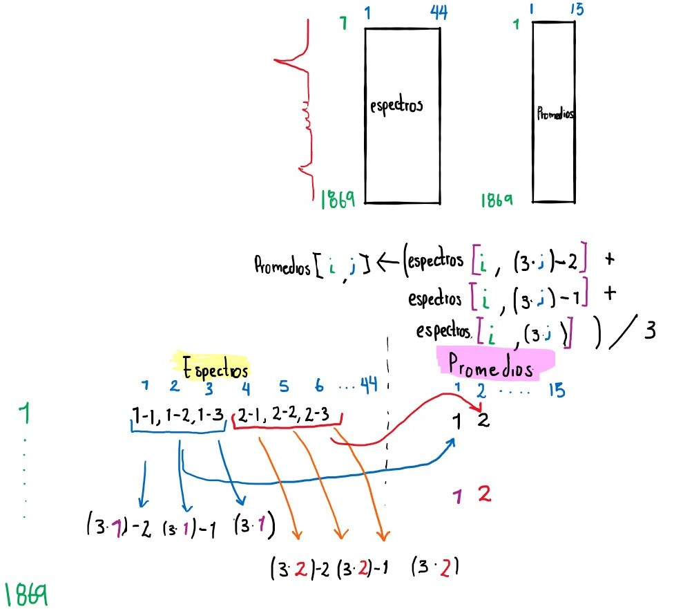

En este documento se describe el tratamiento de los espectros recibidos, en especifico el calculo de los promedios.

Una vez se tienen todos los espectros juntos en un solo archivo, es mas sencillo importarlos a R:
```{r}
espectros <- read.table('espectros.txt') # Leemos las intensidades de los espectros

nombres <- read.table('nombres.txt', sep = '\t')  # Los nombres de las muestras
wavenumber <- read.table('wavenumber.txt') # Los nombres de las variables, los numeros de onda
```

Una vez tenemos cada espectro en una columna, es util tener los nombres de las muestras para identificarlos durante el proceso:

```{r}
colnames(espectros) <- t(nombres) # Se asignan los caracteres en el vector nombres a los nombres de las columnas
head(espectros)# Se imprimen los primeros elementos del data.frame
```


Para obtener los promedios de los espectros, primero debemos crear un objeto para guardar la información que va a ser calculada.


```{r}
promedios <- matrix(,ncol=15, nrow=1869) # Creamos una matriz vacia , con 1869 filas para cada numero de onda y 15 columnas para cada muestra promediada
promedios <- as.data.frame(promedios) #Convertimos el objeto promedios de matriz a data.frame, para poder tener valores numericos y caracteres al mismo tiempo.
str(promedios)# Revisamos la estructura del objeto, que está vacío
```

En los datos suministrados, todos los experimentos tienen medida por triplicado excepto `"@A Room T 4 min 1.CSV"` y ` "@A Room T 4 min 2.CSV"`. Esta medida solo tienen duplicado. Debido a esto el promedio debe hacerse en tres pasos:

# Primer paso

Primero, creamos un vector de caracteres para guardar el tercer elemento de las primeras cinco muestras por triplicado:
```{r}
nombres.prom1 <- vector('character', 5) 
```

Luego, podemos simultaneamente calcular el promedio de cada triada de réplicas y seleccionar el tercer archivo de cada muestra para identificar el promedio con el nombre de esta muestra:

```{r}
for (i in 1:1869){
  for (j in 1:5){
    promedios[i,j] <- (espectros[i,(3*j)-2] + espectros[i,((3*j)-2)+1] + espectros[i,(((3*j)-2)+2)])/3 
   nombres.prom1[j] <- t(nombres)[,3*j]
    
  }
}
```

Una vez tenemos los nombres de las 5 primeras muestras a las que les calculamos el promedio, podemos asignar estos nombres a cada resultado:

```{r}
names(promedios)[1:5] <- nombres.prom1
str(promedios)
```
# Segundo paso

En este punto, el espectro que debe ir en la columna 6 del objeto `promedios`, es el promedio de las réplicas `"@A Room T 4 min 1.CSV"` y ` "@A Room T 4 min 2.CSV"`. 

Verificamos la posición de estos espectros en el data.frame `espectros`:

```{r}
colnames(espectros[,c(16,17)])
```
Y procedemos a guardar en la columnta 6 de `promedios` el promedio de las columnas 16 y 17 del objeto `espectros`

```{r}
for(i in 1:1869){
  
  promedios[i,6] <- (espectros[i,16]+espectros[i,17])/2
}

```

Y asignamos el nombre de la segunda replica al promedio calculado:

```{r}
names(promedios)[6] <- t(nombres)[17]
str(promedios)
```
Una vez calculado el promedio de la muestra por duplicado, podemos continuar y calcular el resto de triplicados de una manera analoga al primer paso.

# Tercer paso

Primero creamos un vector vacio, para guardar los nombres de las muestras que faltan en las ultimas nueve posiciones 

```{r}
nombres.prom3 <- vector('character', 15)
```


De manera analoga al primer paso, calculamos los promedios para las muestras en las columnas del 7 al 15:

```{r}

for (i in 1:1869){
  for (j in 7:15){
    promedios[i,j] <- (espectros[i,(3*j)-3] + espectros[i,((3*j)-3)+1] + espectros[i,(((3*j)-3)+2)])/3 
    nombres.prom3[j] <- t(nombres)[,(3*j)-1]
  }
}		

```


y guardamos los nombres de la tercera replica de cada muestra para identificar cada promedio calculado con la muestra correspondiente.
```{r}
names(promedios)[7:15] <- nombres.prom3[7:15]
str(promedios)
```
En este momento tenemos un `data.frame` con las absorbancias a cada longitud de onda en las filas, y las muestras en las columnas. Es util para un futuro procesamiento de datos tener las variables en las columnas, y los objetos, muestras o individuos en las filas.

Creamos la traspuesta del `data.frame` `promedios`:

```{r}
promedios.t <- t(promedios)
colnames(promedios.t) <- wavenumber[,1]# Agregamos los nombres de las variables
```

Podemos observar el resultado graficando:

```{r}
color <- 1:15
par(new = F)
for(i in 1:15){
  
  plot(wavenumber[,1],
       promedios.t[i,],
       ylim = c(0,0.3),
       xlim = c(4000,400),
       type = 'l',
       col = color[i],
       ylab = 'Absorbancia u.a.',
       xlab = 'numero de onda cm-1'
       
       
        ) 
par(new=T)
  }

```


Una vez tenemos el resultado, podemos exportarlo para utilizarlo en otros programas como excel:

```{r}
rownames(promedios.t) <- sub('.CSV', '', rownames(promedios.t))# quitamos el .CSV del final de cada nombre de muestra
promedios.t <- as.data.frame(promedios.t) #convertimos la traspuesta (un objeto de clase matrix) en un data.frame
write.csv(promedios.t, 'promedios.csv')# Exportamos los espectro promediados
```


A continuacion un ejemplo de como se realizaron los calculos:




